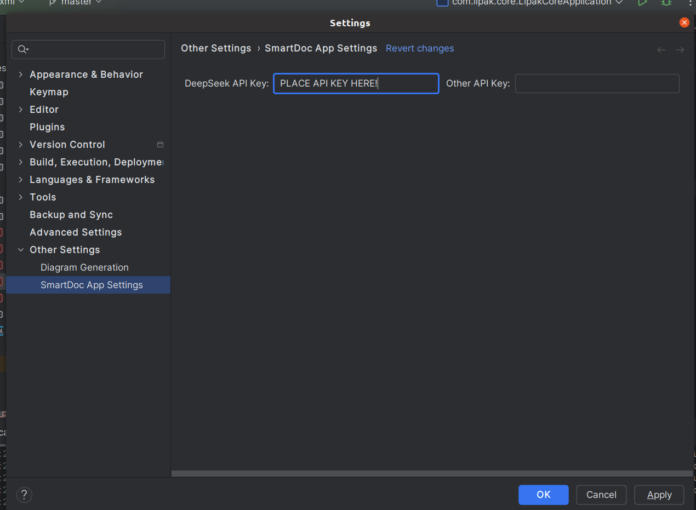
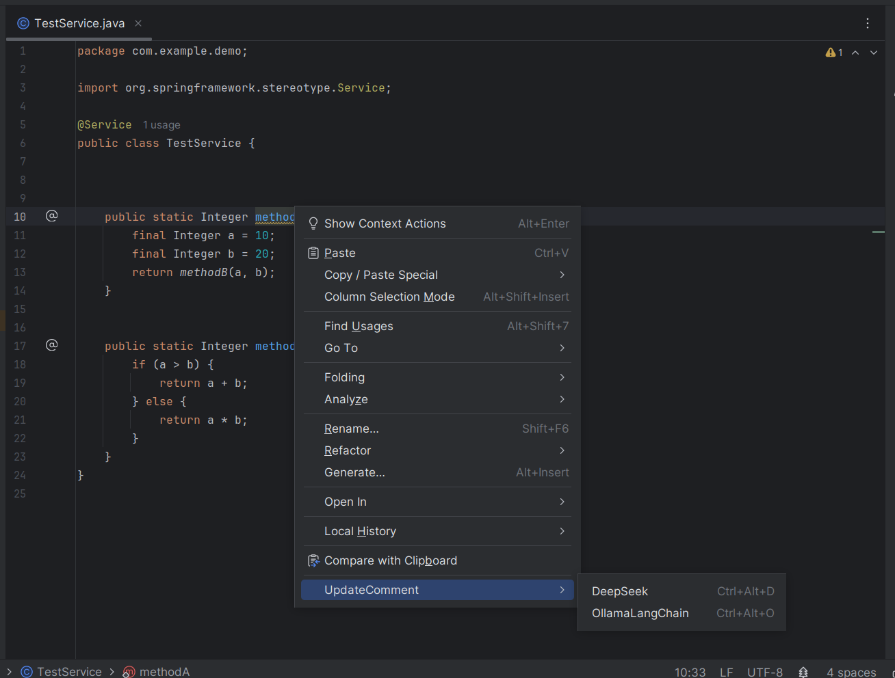
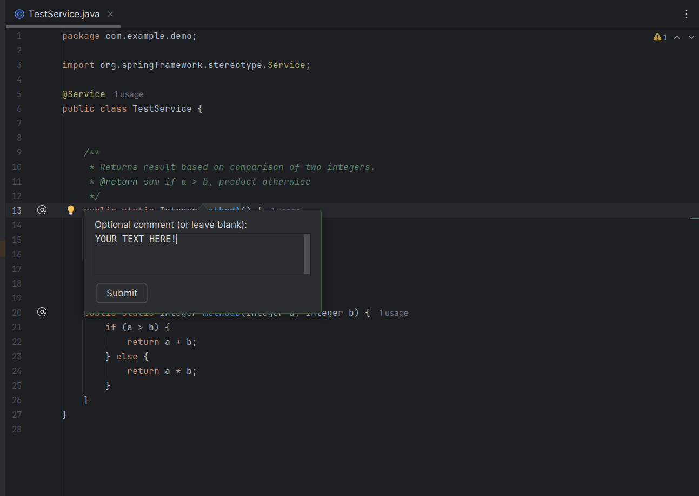

# SmartDoc

SmartDoc is a tool developed as an IntelliJ IDEA plugin to assist developer in JavaDoc style code comment generation.
In its core it involves an AI agent that has its own memory, remote/local LLM connection and static analysis code implementation.
This plugin is developed in Java and will be accessible from IntellJ plugin platform. 

## Architecture

SmartDoc at the abstract level can be represented in a workflow like this:


Which is powered by an AI agent that has the following features:

## Installation

There is two ways you can install this plugin.

(I) Using the compiled wrapped file via running the following command: 

in project dir run (make sure you have ```Gradle 8.10.1+``` installed):
```bash
./gradlew build
```
Once have the project compiled successfully, head to ```/target/classes/distribution/smartdoc.jar``` and add it as a ``` install from disk``` in plugin panel in your IDE.

 (II) Through IntelliJ IDEA plugin market. It needs this plugin shared via this platform. Coming soon!

-- for both options you need Java 21+ installed in your machine, and having preview flag enabled in your IDE (for more info look at [this](https://www.jetbrains.com/guide/java/tips/turn-on-preview-features/)). 
## Usage
To use the plugin, depending on the LLM usage mode, you may need some small configs first:
(I) To use a remote LLM, in this case DeepSeek, you need acquire an API key and place it in ```File --> Settings --> Other Settings --> SmartDoc App Settings --> DeepSeek API Key```

(II) if you use are using a local LLM run by Ollama, do not touch its default port (i.e., 11434). Make sure it is ```codellama:7b``` to get the most of it.

Once have this configs set, when you right-click over a method, you will see something like this: 



Pressing each of models cause starting target method comment becomes updated, editable by you at the end.

## Feedback
We designed a feedback system allowing end user to share their opinion with use, both via rating (1-5) or sending us some texts.

At the end of successful comment assignment you will be ask to rate: 

that is followed by a text you submit:


## Contributing

Pull requests are welcome. For major changes, please open an issue first
to discuss what you would like to change.

Please make sure to update tests as appropriate.

## License

[MIT](https://choosealicense.com/licenses/mit/)